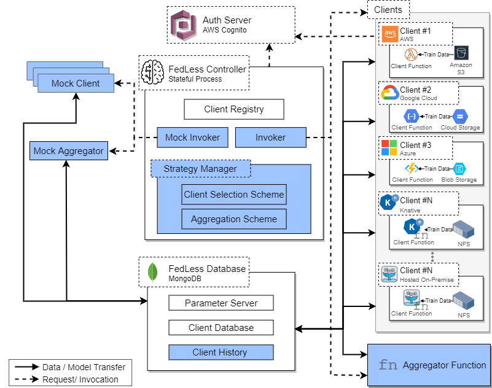

** Disclamer
the code in this project is based on the work done by Andreas  in developing FedLess <https://github.com/andreas-grafberger/thesis-code>

FedLess
================================

## Architecture


the platform architecture is shown above. it contains the following components:

1- **Authentication server**: handles the authentication of the clients.

2- **FedLess Database**: contains info about clients and act as a central parameter and log server.

3- **FedLess Controller**: python process that runs and coordinates the training.

4- **Clients**: serverless functions that perform local training on the client side.

5- **Aggregator function**: aggregates the results from the clients after each round.

6- **Mock client & aggregator**: components that runs locally to simulate the behavior of client & aggregator functions (for development purposes only).

## Installation

Requires Python 3.8 (other Python 3 version might work as well)

```bash
# (Optional) Create and activate virtual environment
virtualenv .venv
source .venv/bin/activate

# Install development dependencies
pip install ".[dev]"
```

## Development

Bash scripts are checked in CI via [ShellCheck](https://github.com/koalaman/shellcheck). For python tests and linting
use the commands below.

```bash
# Run tests
pytest

# Lint
black .
```

## Deployment

The system requires the deployment of a  **mongodb database** to be used as the parameter server. You also need to deploy **client, aggregator and evaluator** (optional)
 functions.

Various scripts require an installed and fully
configured [AWS Command Line Interface](https://aws.amazon.com/cli/?nc1=h_ls). Install and configure it if you want to
deploy functions or images with AWS.  
If possible, we configure and deploy functions (including AWS Lambda)
with the [Serverless Framework](https://www.serverless.com/framework/docs/getting-started/). When using Serverless with
AWS make sure you have everything set up according
to [this guide](https://www.serverless.com/framework/docs/providers/aws/guide/credentials/).

```bash
# Install Serverless Framework (MacOS/Linux only)
curl -o- -L https://slss.io/install | bash
```

If functions are not deployed using Serverless, install the required SDK, e.g., gcloud SDK for google cloud functions, OpenWhisk CLI for OpenWhisk functions, etc.
All functions are located in the *functions* directory, and maybe except those using Serverless, have a *deploy.sh,* script.
Just keep in mind that whenever we use a custom Docker image, you likely have to upload the Python wheel for FedLess to e.g., a custom s3 bucket and change the URL inside Dockerfiles or bash scripts to point to your new file on s3.
For these tasks, just look inside the *scripts* directory, where almost everything should already exist and only should need small adjustments (like changing the base path to your s3 bucket and so on).
The basic workflow is mostly: build FedLess after your changes, upload the wheel to s3, build a new Docker image (scripts for that also contained in *scripts* directory), deploy the function.
Regarding the folder names in the *functions* directory: *client* refers to FedKeeper clients **[deprecated]**, *client-indep* to FedLess clients and *client-indep-secure*
clients are FedLess functions with security enabled.

## Using the system

For this, you can, e.g., take a look at the bash scripts inside *experiment\mnist-demo.yaml*.
You basically have to create a new YAML config file first with information about parameter server, aggregator and client functions.
Here we show a sample of the configuration file to run the experiment. Note that sensitive variables such as `db_username` can be fetched from your env directly and are not required to be specified in the config file.

```
database:
  host: "your db url"
  port: port
  username: db_username
  password: db_password

evaluator:
  params:
    type: openfaas
    url: http://138.246.234.228:31112/function/evaluator
  type: openfaas

aggregator:
  hyperparams:
    tolerance: 2 # specified for fedlesscan strategy only
  function:
    params:
      type: openfaas
      url: aggregator_url
    type: openfaas

clients:
  hyperparams:
    epochs: 2
    batch_size: 5
    optimizer:
      class_name: "Adam"
      config:
        name: "Adam"
        learning_rate: 0.001
    metrics:
      - accuracy
  functions:
    - function:
        params:
          type: openfaas
          url: function_url
        type: openfaas

```

There already exist scripts in the *scripts* folder to deploy a parameter server in a k8 cluster. The same is true for the file server.
Just bear in mind that all bash scripts were not directly designed to be used by other people, so you might have to adjust individual URLs, links to repositories, etc.
To run FedLess functions with enabled security, you basically have to create a custom Cognito user pool with the required app clients, but this is a bit more involved.
The Yaml files and everything in config files conforms to custom Pydantic models located directly inside the code.
Please keep in mind that except for MNIST, you have to host the dataset files yourself. Scripts to download the datasets, create the splits,
deploy the file and parameter servers, etc., also exist in this repository. Just one caveat: the originally required file for the Shakespeare dataset hosted by project Gutenberg
is not reachable directly in Germany due to legal reasons. So you have to host this file yourself and change the URL inside the leaf repository's code. I hosted it on s3 and created a fork of the repository. You can just do so yourself and change the URL to the GitHub repository in the bash script in this directory from my fork to yours.

## CLI 

to run the platform run the entry to the controller module in **fedless.controller.scripts**

run the help command to see the available cli parameters.


Options:
- -d, --dataset [mnist|femnist|shakespeare|speech]
                                  [required]
- -c, --config PATH               Config file with faas platform and client
                                  function information  [required]

- -s, --strategy [fedavg|fedlesscan|fedprox]
                                  [required]
- --clients INTEGER               number of clients  [required]
  --clients-in-round INTEGER      number of clients sampled per round
                                  [required]

- --stragglers INTEGER            number of allowed stragglers per round
-  --timeout FLOAT                 maximum wait time for functions to finish
-  --rounds INTEGER                maximum wait time for functions to finish
-  --max-accuracy FLOAT            stop training if this test accuracy is
                                  reached

-  -o, --out PATH                  directory where logs will be stored
                                  [required]

-  --tum-proxy / --no-tum-proxy    use in.tum.de proxy
-  --proxy-in-evaluator / --no-proxy-in-evaluator
                                  use proxy also in evaluation function
-  --mock / --no-mock              use mocks
-  --simulate-stragglers FLOAT     define a percentage of the straggling clients, this option overrides the
                                  invocation delay if specified in the
                                  function

-  --mu FLOAT                      param for fedprox training
  --help                          Show this message and exit.


